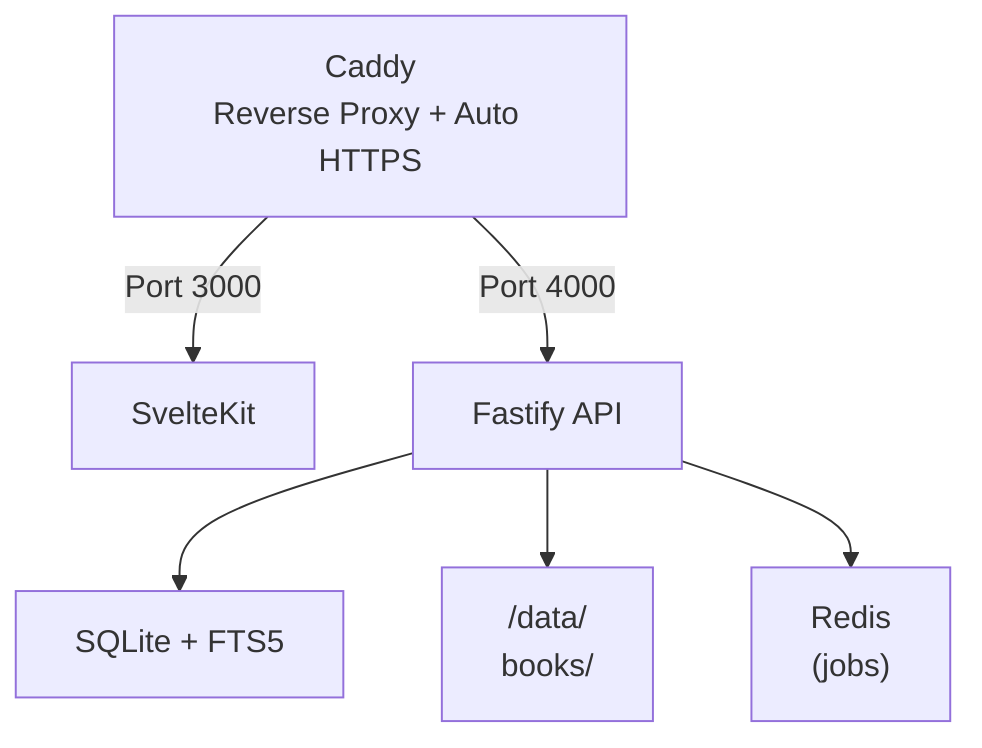

# Digital Library

- [Project Overview](#project-overview)
- [Technology Stack](#technology-stack)
- [Architecture](#architecture)

## Project Overview

Self-hosted, privacy-first digital library that handles EPUB, PDF, CBZ/CBR comics, and loose image files. It is designed to run entirely from a Docker Compose stack with no external cloud services and no recurring costs.

### Core features

- Ligtning-fast full-text search.
- User auth with per-library ACL.
- Native EPUB / PDF / comic readers.
- Rick metadata + auto-fetch.
- Send to Kindle via SMTP.
- Auto-import file watcher.
- Desktop first.

### TO DO

- [ ] Mobile Support.
- [ ] Portability. (Make it run on VPS, NAS, Pi).

## Technology Stack

| Technology                       | Why?                                                                                                                                                                                                                                                                                                                        |
| -------------------------------- | --------------------------------------------------------------------------------------------------------------------------------------------------------------------------------------------------------------------------------------------------------------------------------------------------------------------------- |
| **Fastify + TypeScript**         | 2x faster than Express, first-class TypeScript, great plugin ecosystem.                                                                                                                                                                                                                                                     |
| **SvelteKit**                    | Tiny bundles (than Next.js), witch matters for a reading app that may run on a Raspberry Pi or low-end VPS, file-based routing, SSR out of the box, no virtual DOM overhead. Also, Svelte's reactivity model is a better fit for reader UI state (page position, zoom, layout mode) with less boilerplate than React hooks. |
| **SQLite (better-sqlite3)**      | Zero infra, file-based, ACID, blazing read speed for single-node self-hosted apps.                                                                                                                                                                                                                                          |
| **SQLite FTS5**                  | Built into SQLite, no Elasticsearch overhead, supports prefix & phrase queries.                                                                                                                                                                                                                                             |
| **lucia-auth v3**                | Self-hosted sessions, zero cloud dependencies, supports OAuth later if needed.                                                                                                                                                                                                                                              |
| **epub.js (client-side)**        | De facto standard, supports CFI positions, reflow, custom CSS injection.                                                                                                                                                                                                                                                    |
| **PDF.js (client-side)**         | Mozilla's library, works fully offline, no server-side processing required.                                                                                                                                                                                                                                                 |
| **Open Library API + ComicVine** | Both free, Open Library requires no API key at all.                                                                                                                                                                                                                                                                         |
| **chokidar**                     | Battle-tested, cross-platform, handles rapid write bursts gracefully.                                                                                                                                                                                                                                                       |
| **Calibre CLI (headless)**       | Industry standard, free, packaged in Docker for EPUB to MOBI/AZW3 conversion.                                                                                                                                                                                                                                               |
| **BullMQ + Redis**               | Async metadata fetch and Kindle send jobs. Redis Alpine is only 30MB.                                                                                                                                                                                                                                                       |
| **nodemailer + SMTP**            | Free with Gmail APp Password or any SMTP provider.                                                                                                                                                                                                                                                                          |
| **Docker + Componse**            | One-command deploy, fully portable, no cloud lock-in.                                                                                                                                                                                                                                                                       |
| **Caddy**                        | Auto HTTPS via Let's Encrypt, trivial config, single static library.                                                                                                                                                                                                                                                        |
| **Vitest**                       | SvelteKit already uses internally, zero extra tooling, single test command.                                                                                                                                                                                                                                                 |

## Architecture

### High-level Diagram



### Repository Structure

```txt
digital-library/
  ├── apps/
  │ ├── api/                  # Fastify backend
  │ │ └── src/
  │ │ ├── routes/             # books, auth, libraries, kindle
  │ │ ├── services/           # metadata, importer, smtp
  │ │ ├── db/                 # schema, migrations, queries
  │ │ └── jobs/               # BullMQ workers
  │ └── web/                  # SvelteKit frontend
  │ └── src/
  │ ├── routes/               # SvelteKit page files
  │ ├── lib/readers/          # EpubReader, PdfReader, ComicReader
  │ └── lib/stores/           # reading position, user settings
  ├── packages/
  │ └── shared/               # shared TypeScript types (pnpm workspace)
  ├── data/                   # mounted Docker volume
  │ ├── books/                # all uploaded files
  │ ├── covers/               # generated thumbnails
  │ └── library.db            # SQLite database
  └── docker-compose.yml
```

### Design Patterns

| Pattern                        | Where & Why?                                                                                                                                                                         |
| ------------------------------ | ------------------------------------------------------------------------------------------------------------------------------------------------------------------------------------ |
| **Repository Pattern**         | All DB access goes through typed repository classes (e.g. BookRepository, UserRepository). This keeps raw SQL out of route handlers and makes testing and future storage swaps easy. |
| **Plugin Architecture**        | Each domain (books, auth, libraries, kindle) is a separate Fastify plugin registed with fastify.register(). Clean separation, lazy loading, and scoped decorators.                   |
| **Command / Job Queue**        | Async work like metadata fetch, Kindle send, and thumbnail generator is dispatched as BullMQ jobs rather than blocking the HTTP request. The API returns 202 Accepted immediately.   |
| **Adapter Pattern (Metadata)** | A MetadataAdapter interface with concrete implementations for OpenLibrary, ComicVine, and a FallbackAdapter. Adding a new metedata source does not touch business logic.             |
| **Reader Strategy Pattern**    | A single `<Reader>` Svelte component dispatches to `<EpubReader>`, `<PdfReader>`. or `<ComicReader>` based on `book.format`. Each renders owns its own layout modes and settings.    |
| **FTS5 Shadow Table**          | A virtual FTS5 table mirrors the books table. An SQLite trigger keeps it in sync on insert/update. Searches hit FTS5 for ranking then JOIN back to the main table for metadata.      |
